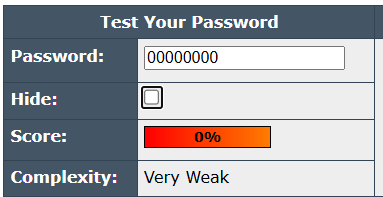
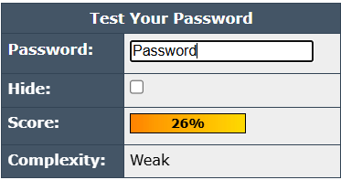
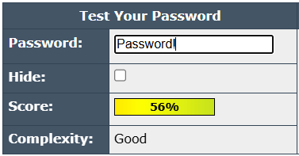

# Password Strength Analysis Project

## Project Objective
The goal of this project is to understand the principles of creating strong passwords and to test passwords of varying complexity against online strength-checking tools.

## Tool Used
* **Password Strength Checker:** An online tool was used to evaluate the strength of example passwords based on various criteria like length, complexity, and common patterns.

## Process Overview
1.  A series of five example passwords were created to test different attributes like repetition, sequences, dictionary words, and character complexity.
2.  Each password was tested using an online strength checker to get a quantitative score and qualitative feedback.
3.  The results were documented with screenshots to analyze how each change affected the password's overall security.
4.  Research was conducted on password best practices and common password attack vectors.

## Analysis of Password Tests
The tests revealed how different characteristics drastically affect a password's strength. The following passwords were tested:

* **`0000000`:** Received the lowest possible score. This password is weak because it is short and consists entirely of repeating, non-complex characters, making it trivial to guess.

* **`Password`:** This is a dictionary word and one of the most commonly used passwords in the world. It is extremely insecure and would be cracked instantly by a dictionary attack.

* **`Password!`:** The addition of a single symbol (`!`) provides a minor improvement by adding character complexity. However, because it's still based on a common dictionary word and a predictable substitution, it remains very weak.

* **`P@$$w0rd`:** This password uses "leetspeak" (substituting letters with numbers and symbols). While stronger than the previous examples due to its complexity, it's still based on a common dictionary word and these substitutions are well-known to cracking tools, making it less secure than a truly random password or passphrase.

## Key Learnings & Best Practices
* **Length is King:** A longer password or passphrase is significantly stronger than a short, complex one.
* **Complexity Matters:** Using a mix of uppercase, lowercase, numbers, and symbols drastically increases the combinations required for a brute-force attack.
* **Avoid Predictability:** Do not use common dictionary words, personal information, or simple sequences. Common substitutions for letters (like '@' for 'a' or '0' for 'o') are easily defeated by modern cracking tools.
* **Use a Password Manager:** To create and store unique, truly random passwords for every site without needing to memorize them.

## Screenshots of Password Strength Tests
*The screenshots below document the evaluation results for each password.*

* **Test 1: `0000000`**
    

* **Test 2: `Password`**
    

* **Test 3: `Password!`**
    

* **Test 4: `P@$$w0rd`**
    

---
## 👤 Author

* **Vritti Garg**
* [LinkedIn](https://www.linkedin.com/in/vritti-garg-682667284/)
